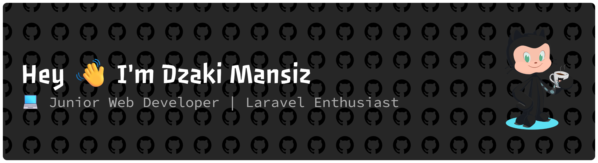

###

  
  

###

<h3 data-importer="text" align="left">👩‍💻  About Me</h3>

###

 

I'm a passionate developer who loves turning ideas into real-world applications.  - 💻 Currently exploring Web Development with PHP, Laravel & JavaScript - 🚀 Enjoy building projects and solving real-world problems through code - 🌱 Always learning new technologies and improving my skills - 🎯 Goal: Become a Professional Full Stack Developer - ☕ Believe that every bug is a lesson, not a failure

###

<h3 data-importer="text" align="left">🛠️ Tech Stack</h3>

###

Languages

###

  
  
  
  
  
  
  

###

Framework

###

  
  
  
  
  

###

Tools

###

  
  
  

###

Database

###

  
  
  
  
  

###

## 🟡 Pac-Man Contribution

